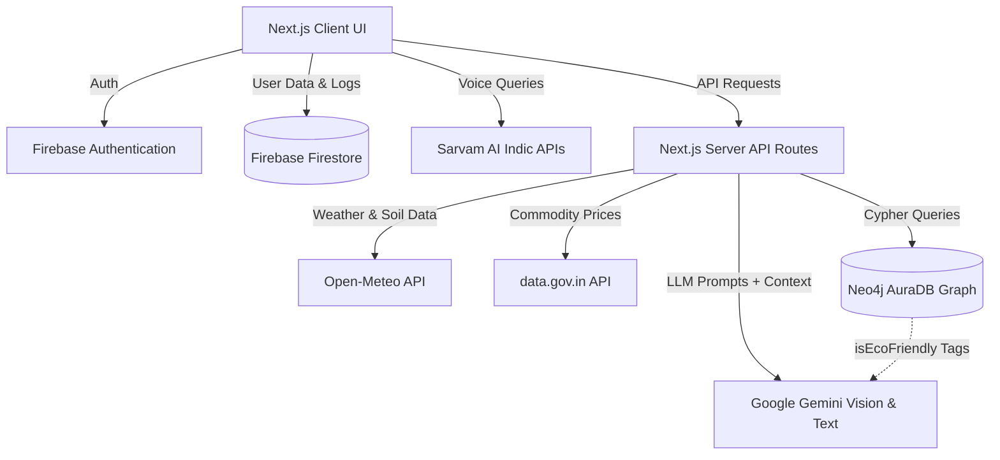

# 🌾 CropWise AI — Smart Farming Advisor

<div align="center">


**An AI-powered digital agronomist for Indian farmers, focused on Climate Resilience and Sustainable Agriculture.**

[Features](#-features) • [System Integrations](#-system-highlights--integrations) • [Tech Stack](#-tech-stack) • [Setup](#-setup--installation) • [Architecture](#-architecture-overview)

</div>

---

## 🚀 System Highlights & Integrations

### 🌍 Climate & Sustainability Systems
* **Farm Eco-Score Engine**: Dynamically calculates a sustainability score (0-100) based on logged farming practices (rewarding organic inputs and manual labor, penalizing synthetics).
* **Carbon & Water Tracking**: Estimates kg CO₂e sequestered and liters of groundwater saved by following AI recommendations.
* **Climate Resilience Alerts**: Scans 7-day weather forecasts to detect severe heatwaves (>38°C) or heavy unseasonal rain (>60%), instantly generating AI-driven protective emergency protocols to preserve crops.
* **Analytics Export**: Generates printable PDF reports visualizing expenditure, carbon saved, water saved, and actionable AI sustainability advice.

### 🕸️ Neo4j Knowledge Graph Integration
* Implemented a **Sustainability Knowledge Graph** using Neo4j AuraDB.
* Maps complex agricultural relationships: `(Crop)-[:ATTACKED_BY]->(Pest)-[:TREATED_BY]->(Treatment)`.
* **Organic Bias Engine**: Cypher queries fetch `isEcoFriendly` tags and `soilHealthBenefit` descriptions, injecting them directly into the Gemini LLM prompt to force the AI to recommend organic/biological treatments over harsh chemicals.

### 🗣️ Sarvam AI Audio Integration
* Integrated Sarvam AI's Indic APIs for a seamless, voice-first farmer experience.
* **Speech-to-Text**: Allows farmers to speak their complex agricultural queries in regional Indian languages instead of typing.
* **Text-to-Speech**: The app reads out AI chat advice, pesticide dosages, and climate alerts in local languages, making the platform accessible to illiterate or visually impaired farmers.

---

## ✨ Core Features

### 🤖 AI Chat Advisor (Voice-Enabled)
- Multilingual conversational AI (English, Hindi, Punjabi, Marathi, Telugu, Tamil).
- **Real-time context injection** — every AI response uses live weather, soil moisture, mandi prices, and user's farm profile.
- Firebase Firestore chat history persistence across sessions.

### 🔬 Pest & Disease Diagnosis
- Upload crop photo → Gemini Vision AI identifies disease/pest.
- Neo4j Knowledge Graph forces **Sustainable/Organic treatments first**.
- Returns disease name, scientific name, and severity level.
- Recommended pesticide names with dosage guidance only as a last resort.

### 🌱 AI Crop Advisor
- Form-based crop recommendation engine analyzing soil type, season, water source, and land area.
- Returns top crop recommendations with full ROI breakdown (Investment, Revenue, Profit, Payback).
- Highlights the carbon footprint and climate risk level of suggested crops.

### 🌤️ Weather Intelligence & Climate Alerts
- **Real GPS location** — browser geolocation + Nominatim reverse geocoding.
- Live temperature, humidity, wind speed, UV index, visibility.
- **Real soil moisture** & **Evapotranspiration (ET₀)** from Open-Meteo.
- 7-day local forecast with 24-hour hourly trend chart.
- **AI Climate Resilience Banner**: Generates dynamic emergency alerts during extreme weather.

### 📈 Market Prices (Mandi Intelligence)
- Live commodity prices from **data.gov.in Agmarknet API**.
- MSP 2024-25 comparison for major crops with 6-month historical trend charts.

### 📋 Activity Log (Farm Ledger)
- Log farm operations: Irrigation, Fertilizer, Pesticide, Weeding, Sowing, Harvesting.
- Filters, sorting, and CSV/PDF data export for accounting.
- Monthly spending calculator powering the AI Sustainability Analytics dashboard.

### 🏛️ Government Schemes
- Curated directory of major agricultural schemes (PM-KISAN, PMFBY, KCC, Soil Health Card).
- Auto-generates application status PDF reports for farmers to track scheme approvals.

---

## 🛠️ Tech Stack

| Category | Technology |
|---|---|
| **Frontend Framework** | Next.js 14 (App Router) |
| **Language** | TypeScript 5.5 |
| **Styling** | Tailwind CSS 3.4 |
| **Database (Relational/Graph)** | Neo4j AuraDB |
| **Database (NoSQL) & Auth** | Firebase (Firestore, Authentication) |
| **AI / LLM** | Google Gemini API (`gemini-2.5-flash`) |
| **Audio AI** | Sarvam AI (Speech-to-Text, Text-to-Speech) |
| **Weather API** | Open-Meteo API |
| **Market Prices API** | data.gov.in Agmarknet API |
| **Charts & Icons** | Recharts 2.12, Lucide React |

---

## ⚙️ Setup & Installation

### Prerequisites
- Node.js 18+
- Firebase project
- Google Gemini API key
- Neo4j AuraDB instance
- Sarvam AI API key

### 1. Clone the repository
```bash
git clone https://github.com/your-username/cropwise-ai.git
cd cropwise-ai/website\ 2
```

### 2. Install dependencies
```bash
npm install
```

### 3. Configure environment variables
Create a `.env.local` file in the project root:

```env
# ── Google Gemini AI ──
GEMINI_API_KEY=your_gemini_api_key_here

# ── Neo4j AuraDB ──
NEO4J_URI=bolt://your-instance.databases.neo4j.io
NEO4J_USERNAME=neo4j
NEO4J_PASSWORD=your_neo4j_password

# ── Sarvam AI ──
SARVAM_API_KEY=your_sarvam_api_key

# ── Firebase Client SDK ──
NEXT_PUBLIC_FIREBASE_API_KEY=your_firebase_api_key
NEXT_PUBLIC_FIREBASE_AUTH_DOMAIN=your_project_id.firebaseapp.com
NEXT_PUBLIC_FIREBASE_PROJECT_ID=your_project_id
NEXT_PUBLIC_FIREBASE_STORAGE_BUCKET=your_project_id.appspot.com

# ── Market Prices ──
MARKET_API_KEY=your_data_gov_in_api_key
```

### 4. Seed the Neo4j Knowledge Graph
Start the server and visit the seed endpoint to load the sustainability graph:
```bash
npm run dev
# Then visit: http://localhost:3000/api/neo4j/seed
```

### 5. Run the application
```bash
npm run dev
```
Open [http://localhost:3000](http://localhost:3000)

---

## 🏗️ Architecture Overview



---

## 🌐 Supported Regions

GPS auto-detection works anywhere in India. Fallback coordinates are configured for:

| State | Default City |
|---|---|
| Punjab | Ludhiana |
| Madhya Pradesh | Bhopal |
| Maharashtra | Aurangabad |
| Uttar Pradesh | Lucknow |
| Gujarat | Rajkot |
| Rajasthan | Ajmer |
| Haryana | Hisar |
| Andhra Pradesh | Guntur |
| Telangana | Hyderabad |
| Karnataka | Dharwad |
| Tamil Nadu | Coimbatore |
| Bihar | Patna |
| West Bengal | Barddhaman |
| Odisha | Cuttack |
| Chhattisgarh | Raipur |

---

## 🌍 Languages Supported

| Code | Language | Script |
|---|---|---|
| `en` | English | Latin |
| `hi` | Hindi | Devanagari |
| `pa` | Punjabi | Gurmukhi |
| `mr` | Marathi | Devanagari |
| `te` | Telugu | Telugu |
| `ta` | Tamil | Tamil |

---

## 🤖 Gemini AI Models

The app supports multiple Gemini models — switch in `app/api/gemini/route.ts`:

| Model | Tier | Rate Limit | Best For |
|---|---|---|---|
| `gemini-1.5-flash-latest` | Free | 15 req/min | Default use |
| `gemini-1.5-pro-latest` | Free | 2 req/min | Better reasoning |
| `gemini-2.0-flash` | Paid | 1000 req/min | Production |

```typescript
// app/api/gemini/route.ts — line 28
const MODEL_TEXT   = "gemini-1.5-flash-latest"; // change here
const MODEL_VISION = "gemini-1.5-flash-latest"; // and here
```

---

## 📊 Real-Time Data Sources

| Feature | Data Source | Refresh |
|---|---|---|
| Temperature, Humidity, Wind | Open-Meteo API | Live |
| Soil Moisture | Open-Meteo `soil_moisture_0_to_1cm` | Live |
| Evapotranspiration (ET₀) | Open-Meteo FAO-56 PM method | Daily |
| Solar Radiation | Open-Meteo `shortwave_radiation_sum` | Daily |
| 7-Day Forecast | Open-Meteo | Every 30 min |
| GPS Location | Browser Geolocation API | On load |
| City/State Name | Nominatim reverse geocoding | On GPS fetch |
| Mandi Prices | data.gov.in Agmarknet | Daily |
| MSP Values | GOI 2024-25 (hardcoded) | Annual |
| Chat History | Firebase Firestore | Real-time |
| User Profile | Firebase Firestore | On save |
| Activity Logs | Firebase Firestore | On action |

---

## 🔐 Security

- All routes protected by `AuthGuard` component
- Firebase Auth JWT validation on every request
- Firestore Security Rules enforce user-level data isolation
- Admin SDK private key only used server-side (never exposed to browser)
- `NEXT_PUBLIC_` prefix only on safe, public Firebase config values

---

## 🧪 Troubleshooting

### Gemini API 429 Error
```
[429 Too Many Requests] You exceeded your current quota
```
→ Free tier rate limit hit. Wait 1 minute, or get a new API key from a different Google account at [aistudio.google.com](https://aistudio.google.com/app/apikey)

### Gemini API 404 Error
```
models/gemini-1.5-flash is not found
```
→ Deprecated model name. Make sure `route.ts` uses `gemini-1.5-flash-latest`

### Location showing Bhopal (default)
→ Browser GPS permission denied. Fix:
1. Click the 🔒 lock icon in Chrome address bar
2. Set Location → Allow
3. Run in browser console: `sessionStorage.removeItem("cropwise_user_location")`
4. Refresh the page

### Firebase Authentication Error
→ Ensure Email/Password and Google sign-in methods are enabled in Firebase Console → Authentication → Sign-in method

### Market Prices showing fallback data
→ `MARKET_API_KEY` not set in `.env.local`. Register free at [data.gov.in](https://data.gov.in/user/register) to get real mandi prices.

---

## 📦 Key Dependencies

```json
{
  "next": "14.2.5",
  "@google/generative-ai": "^0.15.0",
  "firebase": "^10.12.4",
  "firebase-admin": "^12.3.1",
  "recharts": "^2.12.7",
  "lucide-react": "^0.414.0",
  "tailwindcss": "^3.4.7",
  "typescript": "^5.5.3",
  "uuid": "^10.0.0",
  "date-fns": "^3.6.0"
}
```

---
*Built with ❤️ for Indian Farmers*
